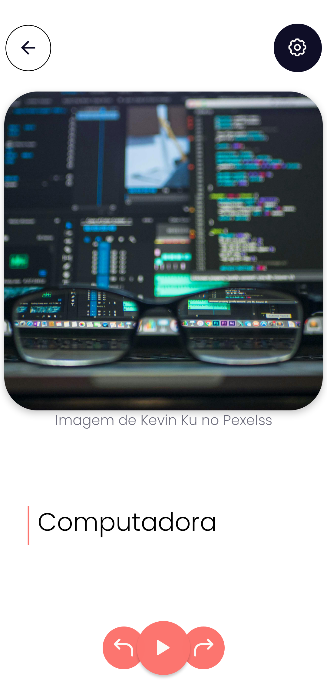
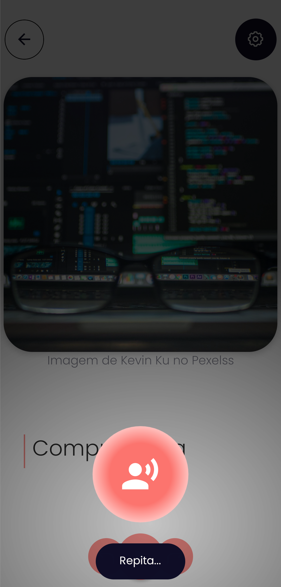
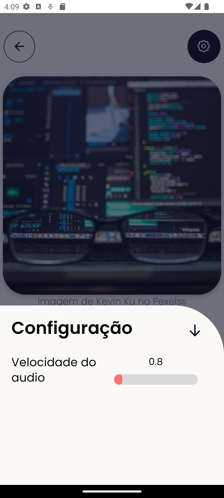

# HablaBien - Estimulando seu Espanhol com Exercícios de Fonoaudiologia

# Visão Geral

Este é um aplicativo de estimulação do espanhol, com o foco em estimular seu espanhol por meio de exercícios, criada com base em conceitos fonoaudiológicos para aprimorar sua comunicação e sua pronúncia com exercícios eficazes e práticos.

## Como Funciona

O aplicativo consiste em aprimorar a sua expressão e compreensão do espanhol de maneira inovadora, por meio de exercícios orais focados em alcançar uma pronúncia clara e precisa. Projetado para atender todos os publicos, **HablaBien** tem um design atraente para as crianças e ao mesmo tempo moderna. Além de ser uma escolha ideal para profissionais de saúde que desejem praticidade ao interagir com seus clientes.

### 🙇 Escucha Y Repite

Escucha y repite é um exercício que irá aprimorar suas habilidades em espanhol. Neste exercício, você consegue escutar um áudio em espanhol e, em seguida, repeti-lo para aprimorar sua pronúncia. A interface deste exercício permite que você avance para o próximo áudio ou retroceda, proporcionando flexibilidade ao seu ritmo de aprendizado.

Destacamos a funcionalidade de ajuste da velocidade do áudio, permitindo que você configure conforme sua preferência. Essa opção visa otimizar a compreensão auditiva, adaptando-se ao seu nível de proficiência. Experimente o **Escucha y Repite** para uma prática auditiva dinâmica e personalizada no caminho para a fluência em espanhol.

#### Detalhes Técnicos

- **Geração de palavras em espanhol:**  
  A aplicação utiliza a API open-source [Random Words API](https://github.com/mcnaveen/Random-Words-API) para gerar palavras aleatórias em espanhol.

- **Geração de imagens:**  
  As imagens exibidas no aplicativo são obtidas através da plataforma [Pexels](https://www.pexels.com), que oferece imagens de alta qualidade e livres de direitos autorais.

### 💻 Mais exercícios estão a caminho!

## Contribuições

Este projeto é de código aberto vizando o aprendizado e as contribuições são bem-vindas. Se você encontrar problemas ou tiver ideias para melhorias, sinta-se à vontade para criar problemas (issues) ou enviar pull requests no repositório do projeto.

Agradecemos por escolher o HablaBien. Esperamos que este aplicativo proporcione uma experiência de aprendizado valiosa e gratificante para aprimorar suas habilidades em espanhol. ¡Para hablar bien, ven a HablaBien! 🌟
